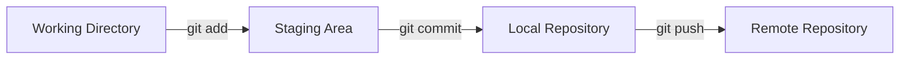
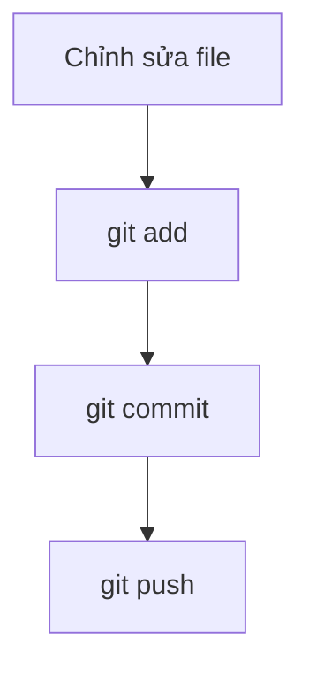
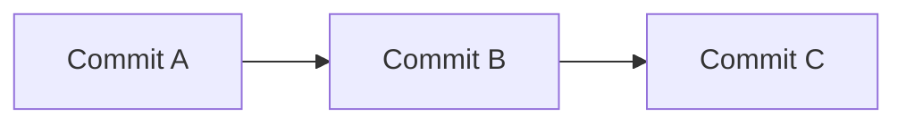
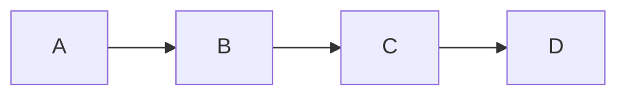
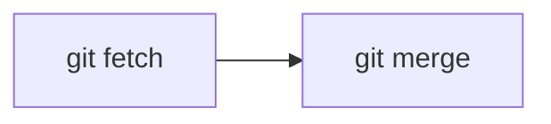
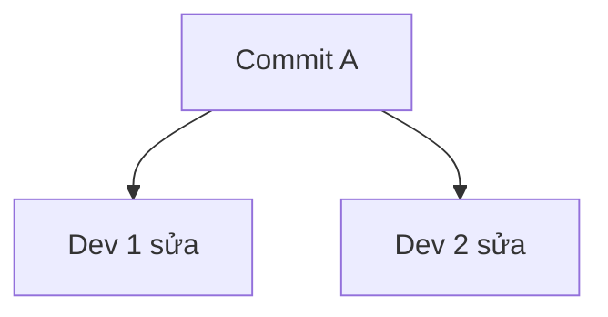
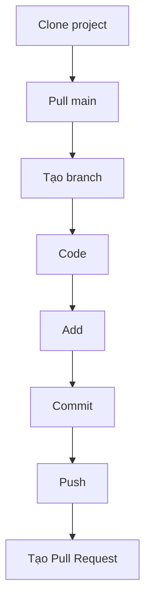

# TÀI LIỆU CƠ BẢN VỀ GIT & GITHUB

# 1. Tổng quan

## 1.1 Git là gì?

Git là hệ thống quản lý phiên bản (Version Control System – VCS).

Mục đích:

* Lưu lịch sử thay đổi của source code
* Cho phép làm việc nhóm
* Hỗ trợ tạo nhánh (branch)
* Có thể quay lại phiên bản cũ

---

## 1.2 GitHub là gì?

**GitHub** là nền tảng lưu trữ Git repository trên cloud.

Phân biệt:

| Thành phần | Vai trò                              |
| ---------- | ------------------------------------ |
| Git        | Công cụ quản lý version (chạy local) |
| GitHub     | Nơi lưu trữ repository online        |

---

# 2. Kiến trúc hoạt động của Git

Git có 4 khu vực chính:



## 2.1 Working Directory

* Thư mục chứa source code
* Nơi bạn chỉnh sửa file

## 2.2 Staging Area

* Nơi chuẩn bị các file sẽ commit
* Kiểm soát nội dung commit

## 2.3 Local Repository

* Thư mục `.git`
* Lưu lịch sử commit

## 2.4 Remote Repository

* Lưu trên GitHub
* Dùng để đồng bộ với team

---

# 3. Chu trình làm việc cơ bản



Giải thích:

1. Sửa file
2. `git add` → đưa vào staging
3. `git commit` → tạo snapshot
4. `git push` → gửi lên remote

---

# 4. Cài đặt và khởi tạo dự án

## 4.1 Khởi tạo repository

```bash
git init
```

Tạo thư mục `.git`

---

## 4.2 Kiểm tra trạng thái

```bash
git status
```

---

## 4.3 Thêm file vào staging

```bash
git add filename
```

Hoặc:

```bash
git add .
```

---

## 4.4 Commit

```bash
git commit -m "feat: add login API"
```

---

# 5. Cấu trúc Commit

Git lưu commit theo chuỗi:



Mỗi commit gồm:

* Hash ID
* Author
* Message
* Snapshot project
* Parent commit

---

# 6. Branch

## 6.1 Branch là gì?

Branch là con trỏ đến commit cuối cùng.



Ví dụ:

* main → commit C
* feature → commit D

---

## 6.2 Tạo branch

```bash
git switch -c feature/login
```

---

## 6.3 Chuyển branch

```bash
git switch main
```

---

# 7. Làm việc với Remote

## 7.1 Thêm remote

```bash
git remote add origin https://github.com/user/project.git
```

---

## 7.2 Push lần đầu

```bash
git push -u origin main
```

---

## 7.3 Pull

```bash
git pull origin main
```

Bản chất:



`git pull` = fetch + merge

---

# 8. Conflict

Xảy ra khi hai người sửa cùng một đoạn code.



Khi merge sẽ xuất hiện conflict.

File conflict:

```
<<<<<<< HEAD
Code của bạn
=======
Code của người khác
>>>>>>> branch-name
```

Cách xử lý:

1. Chỉnh sửa lại cho đúng
2. Xóa marker
3. `git add .`
4. `git commit`

---

# 9. Workflow chuẩn cho người mới



---

# 10. Các lệnh cần nhớ

| Lệnh              | Chức năng             |
| ----------------- | --------------------- |
| git status        | Kiểm tra trạng thái   |
| git add           | Thêm file vào staging |
| git commit        | Tạo commit            |
| git log --oneline | Xem lịch sử           |
| git branch        | Xem branch            |
| git switch        | Chuyển branch         |
| git push          | Đẩy lên remote        |
| git pull          | Cập nhật từ remote    |

---

# 11. Những nguyên tắc cơ bản

1. Không commit trực tiếp vào main (khi làm team)
2. Luôn pull trước khi push
3. Commit message rõ ràng
4. Không commit `.env`, `node_modules`, `vendor`

---

# 12. Kiến thức cốt lõi cần nắm

* Git lưu snapshot, không lưu từng dòng
* Branch là pointer
* Pull = fetch + merge
* Commit là đơn vị version

